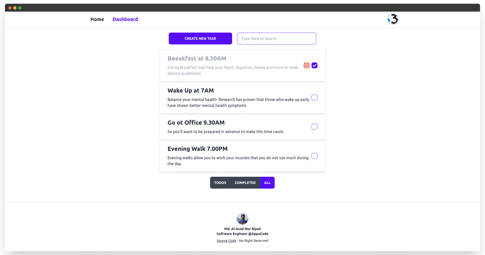
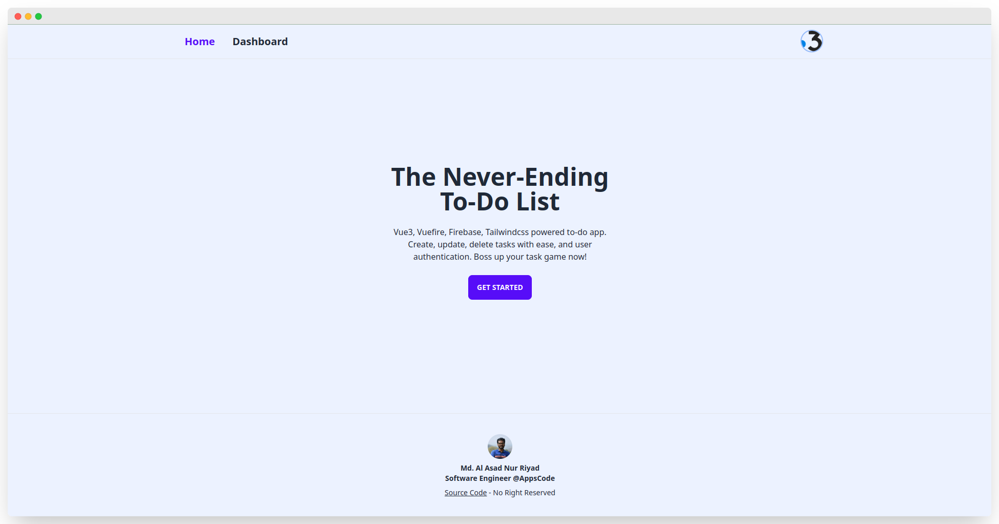
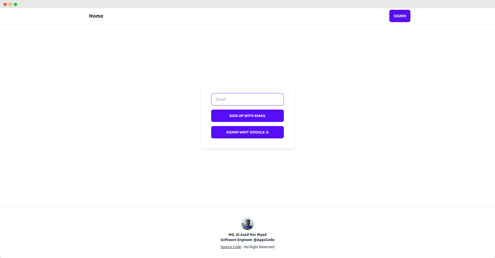

# Vuefire Todos

Vue3, Vuefire, Firebase, Tailwindcss powered to-do app. Create, update, delete tasks with ease, and user authentication. Boss up your task game now!


## Demo

https://vuefire-todos.netlify.app/

> Hosted on [Netlify](https://netlify.com/): 


### Built with

<p align="center">
    
</p>

Vuefire Todos built with [Vue3](https://vuejs.org), [Vuefire](https://vuefire.vuejs.org/) [Vue-Router](https://router.vuejs.org/) & [Tailwind](https://tailwindcss.com/)


## Previews

<p align="center">
  <a href="https://vuefire-todos.netlify.app/" target="_blank">
    
    
    
    <br>
    Live Demo
  </a>
</p>


## Features

- Client Side Rendering
- Vite-based hot module replacement (HMR) dev environment
- Deploys anywhere with zero config Netlify
- Login with password less email link
- Login with gmail
- Route Protection
- Dom change animation
- Crate Task with description
- Show task my it's status
- Search task my title

## Build Setup

**Requires Node.js 16+**

```bash
# install dependencies
yarn install

# serve in dev mode, with hot reload at localhost:5173
yarn run dev

# build for production
yarn run build

# serve in production mode
yarn run preview

```
